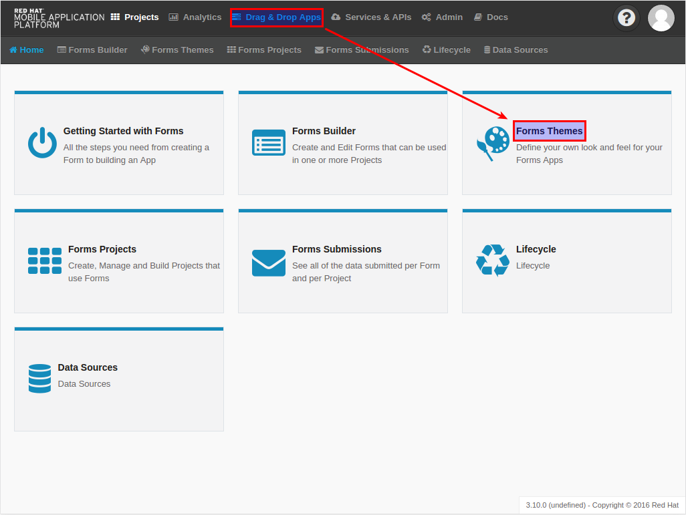
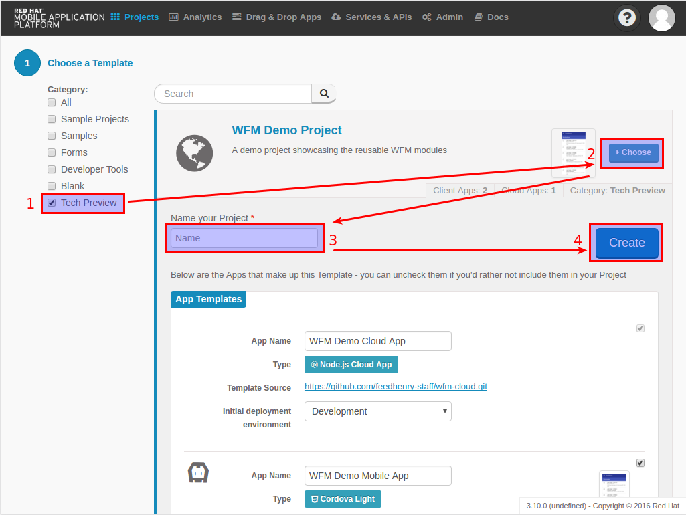
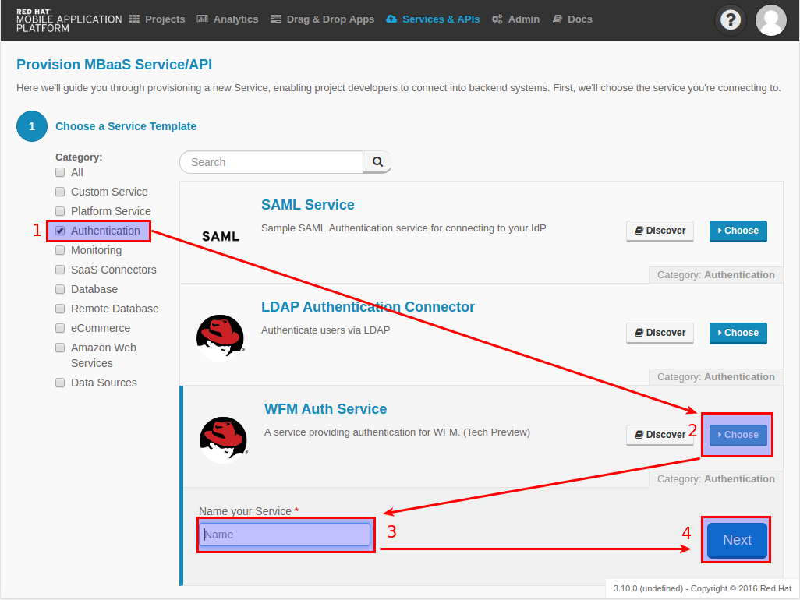
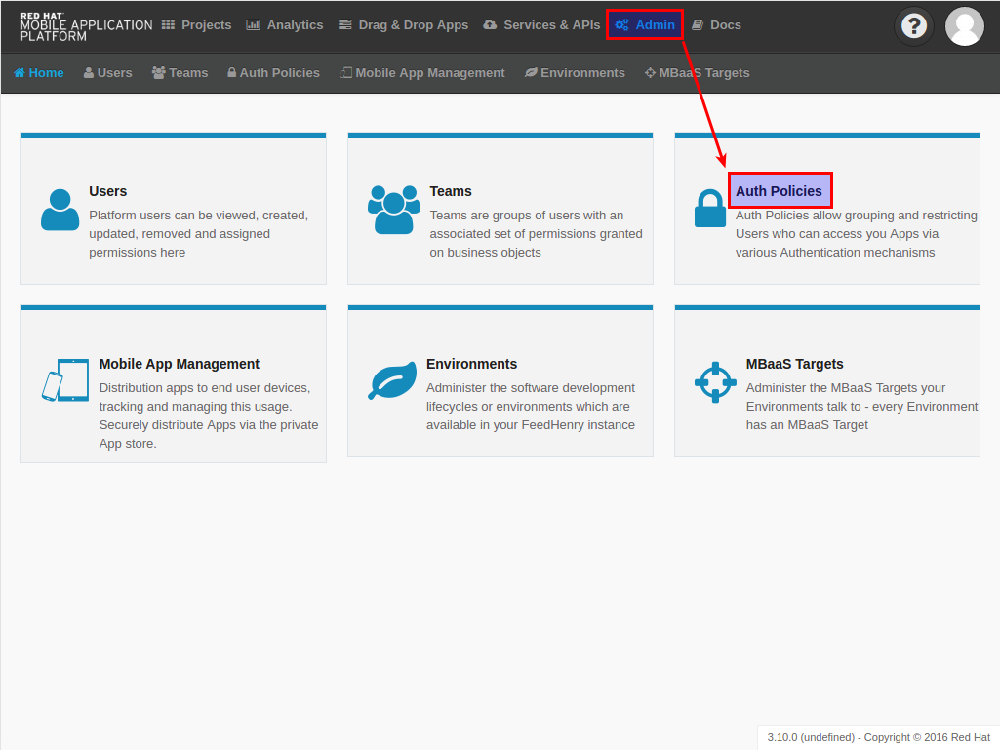
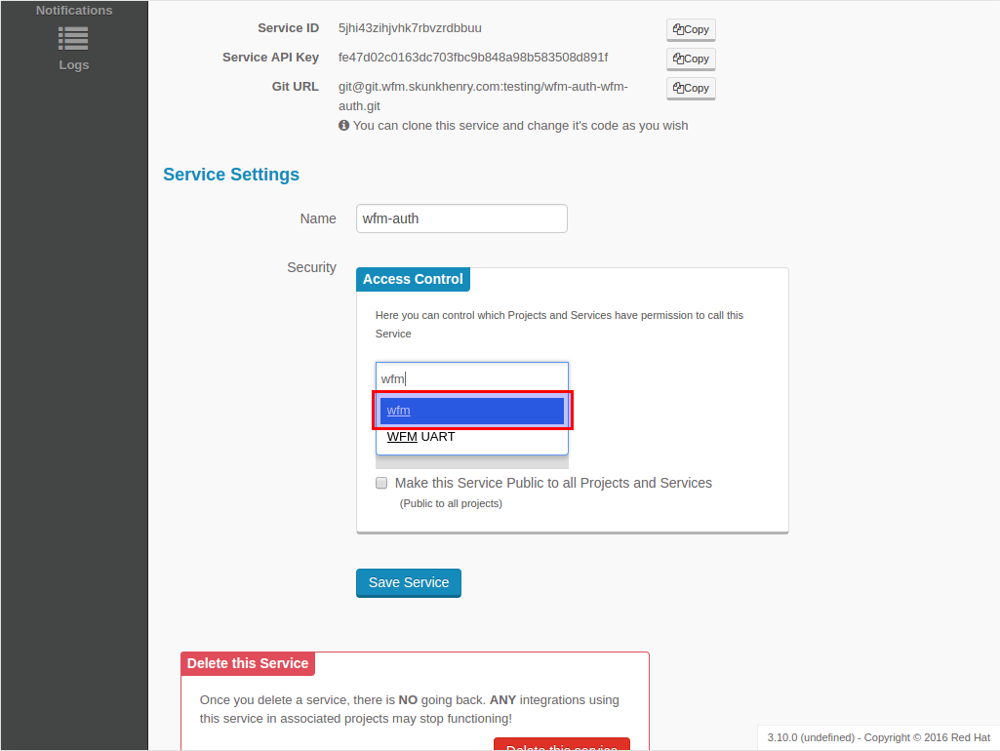
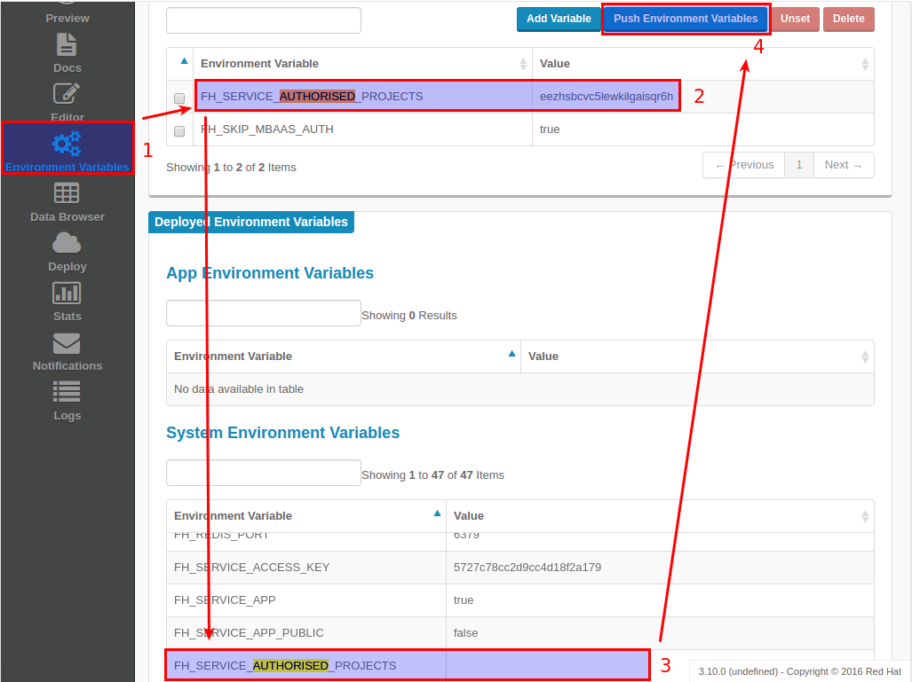
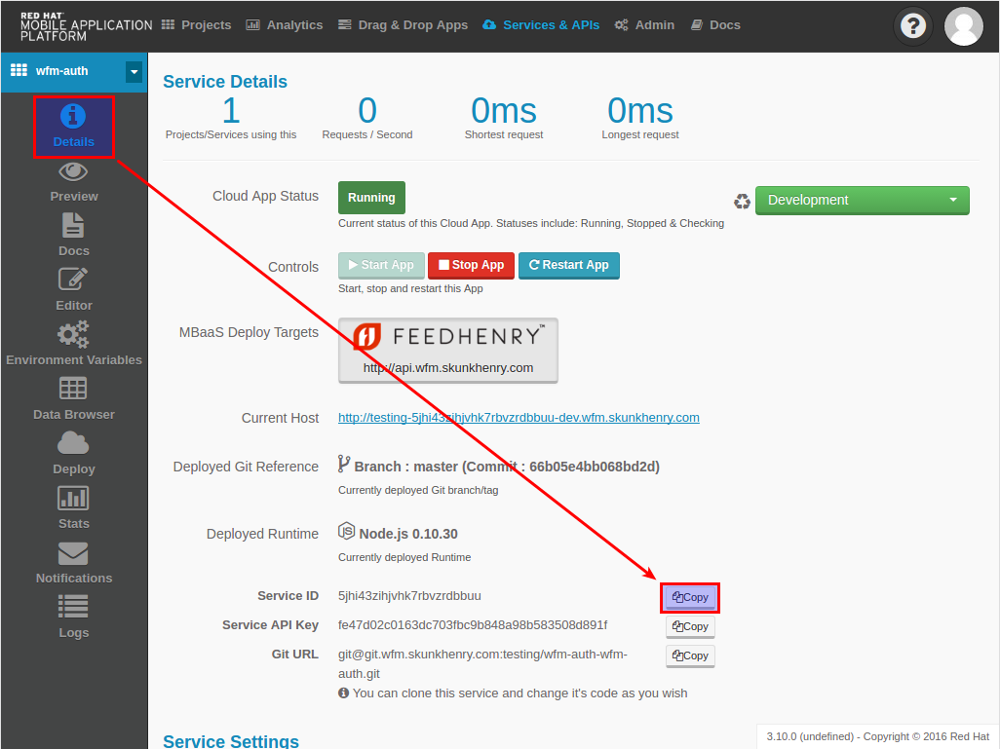
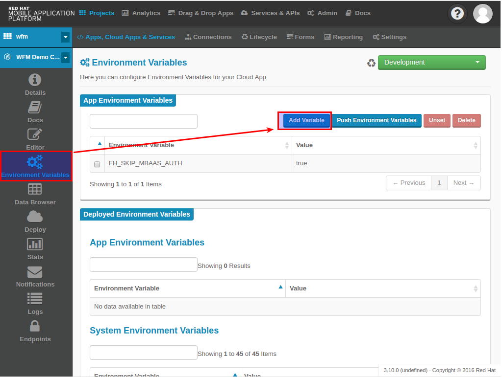
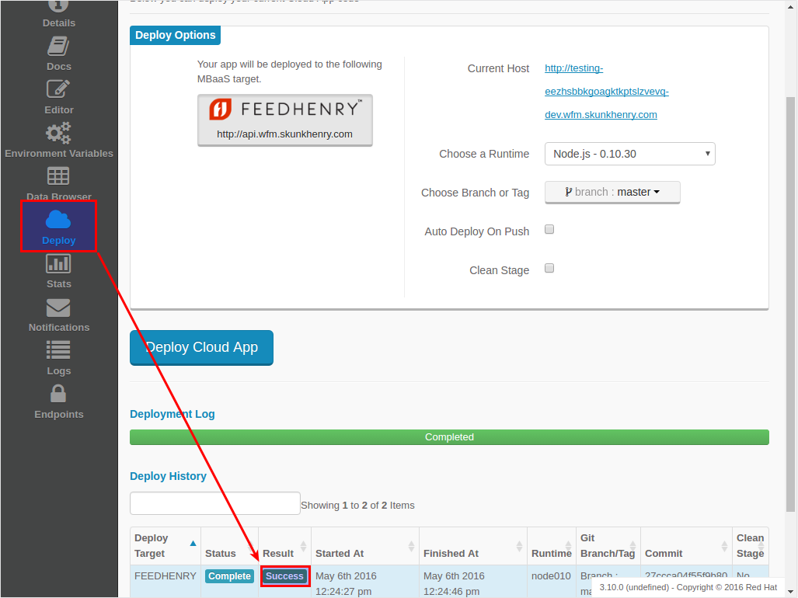

# Getting Started with WFM

## Overview
A Field Workforce Management (WFM) application connects a business' back-office with its fleet of mobilized employees.  FeedHenry WFM leverages commoditized mobile hardware, making use of each employee's mobile phone.

## WFM Structure
WFM 2 consists of a set of reusable modules. A demo application is provided as a project template that showcases how these modules can be assembled into an application.

### WFM Modules
WFM modules are packaged and distributed via [npm](https://www.npmjs.com/).  They are designed to be included in your application using [browserify](http://browserify.org/).  WFM modules exports one or more of:

* Angular.js directives or services providing client-side functionality for both the mobile and portal clients.
* Express.js routes providing a REST API to be consumed by the client-side portions of the module.
* FeedHenry sync configurations for enabling data synchronization of a module's data.

Refer to the READMEs of the respective modules for details on their purpose and consumption.

#### Loose Coupling
WFM modules make use of the [mediator pattern](https://addyosmani.com/largescalejavascript/) to enable loose coupling between the WFM modules and their consuming applications.  Refer to the WFM mediator README for usage instructions and API details.

### WFM Demo Apps
The demo applications run on Red Hat Mobile Application Platform (RHMAP).  The demo project consists of:

* **wfm-portal**: a sample back-office application.
This is where work is collected and pushed to the workers out in the field.
* **wfm-mobile**: is the mobile application running on the field workers' mobile devices.
* **wfm-cloud**: the cloud application provides the gateway into the RHMAP MBaaS.
* **wfm-auth**: an MBaaS service that integrates with the FeedHenry authentication system.

## Running the WFM Demo Apps
RHMAP provides a set of WFM project templates to help you get the WFM demo apps up and running.

### Create and Configure the WFM Demo Project Using the Project Templates

1. Create a blank Forms theme.
  1. Navigate to **Drag & Drop Apps -> Forms Themes**.
     

  2. Click **New Theme**.
  3. Select the **Base Template**.
  4. Name the theme, for example **wfm**.
  5. Click **Create**.

2. Create a new project using the **WFM Demo Project** template.
  1. Select the **Projects** header menu item.
  2. Click **New project**.
  3. Select the **WFM Demo Project** template (under **Tech Preview**).
  4. Name the project, for example **wfm-demo**.
  5. Click **Create**.
  6. Wait until the project gets created, then click **Finish** at the bottom of the page.
     

3. Create a new MBaaS Service using the **WFM Auth Service** template.
  1. Select the **Services & APIs** header menu item.
  2. Click **Provision MBaaS Service/API**.
  3. Select the **WFM Auth Service** template (under Authentication).
  4. Name the service, for example **wfm-auth**.
  5. Click **Next**.
     

  6. Select the environment for initial deployment.
  7. Click **Next**.
  8. Click **Finish**.
  9. On the **Details** page of the MBaaS service, select **Deploy** from the left-hand side menu.
  10. Click **Deploy Cloud App**.

4. Create an auth policy using this new MBaaS service.
  1. Navigate to **Admin -> Auth Policies**.
     

  2. Click **Create**.
  3. Name the policy, for example **wfm-auth-policy**.
  4. Select the **MBaaS Service** type.
  5. Select the `wfm-auth` service.
  6. Enter `/api/wfm/user/auth` as the endpoint.
  7. Select the default environment.
  8. Validate the settings using the user name `trever` and password `123`.

    * The response JSON should have the `status` property with value `ok`.

  9. Click **Create Auth Policy**.

5. Associate the **WFM Auth Service** MBaaS service with the project.
  1. Select the **Services & APIs** header menu item.
  2. Select the **WFM Auth Service** created in step 3.
  3. Scroll down to the **Service Settings**, **Access Control**; select the project created above; eg. **wfm**.
     

  4. Click the **Save Service** button.
  5. From the left-hand side menu, select **Environment Variables**.
  6. Compare the `FH_SERVICE_AUTHORISED_PROJECTS` in the *App* section to the one in the *System* section. If they differ, click the **Push Environment Variables** button.
     

6. Copy the project ID from the MBaaS service, and set it as the `WFM_AUTH_GUID`.
  1. From the left-hand side menu, select **Details**.
  2. Click the **Copy** button next to the **Service ID field**.
   

  3. Select the **Projects** header menu item.
  4. Select the **wfm-demo** project created in step 2.
  5. Select the cloud app.
  6. From the left-hand side menu, select **Environment Variables**.
  7. Click **Add Variable**.
     

  8. Enter `WFM_AUTH_GUID` for the **name**, and paste in the **Service ID** copied above for the **value**.
  9. Click **Push Environment Variables**.

7. Finally, check that the auth service, the cloud app, and the portal app are all deployed and started.
  1. For each of the above mentioned apps, select **Deploy** from the left-hand side menu.
  2. Ensure that the most recent deployment has a **result** of **Success**.
   

  3. If it does not indicate success, click **Deploy Cloud App** and verify the next deployment is successful.

The apps are now created, configured, and deployed.
